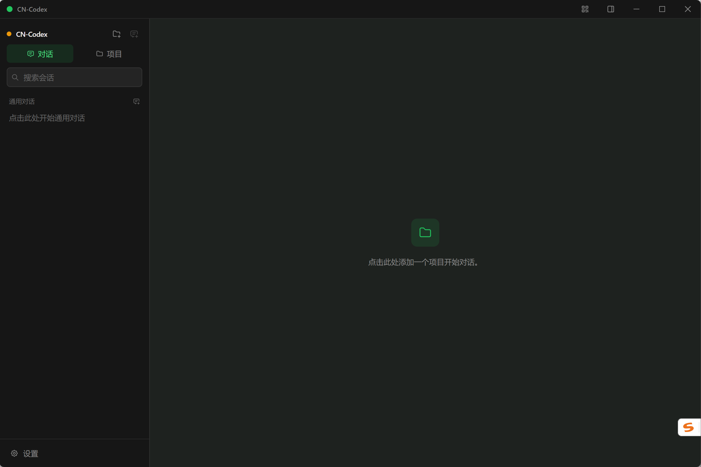
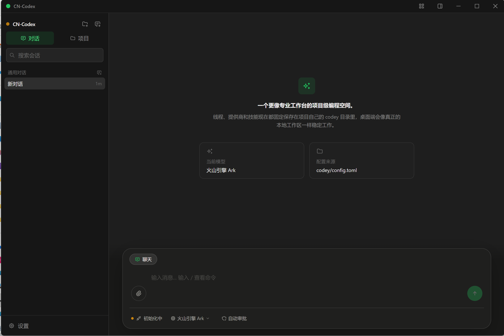
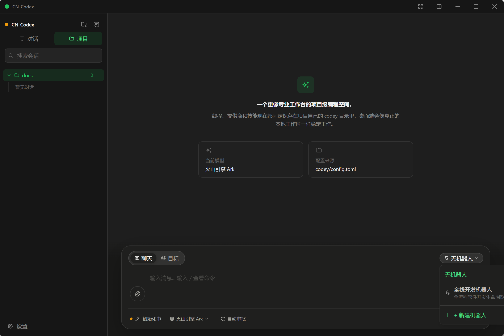
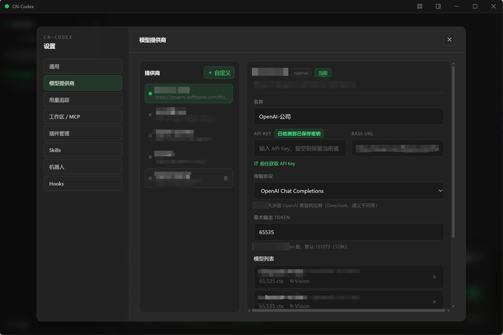

# CN-Codex

  

<h3 align="center">AI-Powered Programming Assistant Desktop App</h3>

  More than chat — a real AI workbench that writes code, runs commands, and completes tasks for you

  <a href="README.md">中文</a> |
  <a href="README.en.md">English</a> |
  <a href="README.ja.md">日本語</a> |
  <a href="README.fr.md">Français</a> |
  <a href="README.de.md">Deutsch</a>

  <a href="http://47.113.221.244:8081/">Website</a> •
  <a href="http://47.113.221.244:8081/usage.html">User Guide</a> •
  <a href="https://github.com/longdream/cn-codex">GitHub</a>

---

## Why CN-Codex?

Traditional AI coding assistants only chat. CN-Codex is a **complete AI workbench** — it directly reads and writes your code, executes shell commands, controls browsers, manages sub-agents working in parallel, and even lets you monitor AI progress remotely from your phone.

- **40+ Built-in Tools** — File operations, command execution, browser automation, sub-agents, MCP protocol, and more
- **12+ LLM Providers** — OpenAI, Anthropic, Google, DeepSeek, Volcengine, Tongyi Qianwen, Zhipu, Moonshot, SiliconFlow, Baichuan, Ollama, LM Studio
- **Goal Mode** — Set a goal and let AI autonomously plan and execute multi-step tasks
- **Plugins + Skills + Robots** — An extensible automation system to build your own AI workflows
- **Mobile Sync via QR Code** — LAN direct connection or public relay, control your AI assistant anywhere
- **Ultra Lightweight** — Install package only ~20MB, sub-second startup, zero lag with native Rust performance
- **Ready Out of the Box** — Download, double-click, and start. No CLI installation or environment variables needed

---

## Interface Preview

  

<em>First Launch — Clean dark interface with project management on the left, chat area in the center</em>

 

  

<em>Smart Chat — Streaming output, model switching, auto-approval, status bar at a glance</em>

 

  

<em>Project Mode — Chat/Goal dual-mode switch, robot selector, AI works in your project directory</em>

 

  

<em>Provider Config — Visual GUI to manage multiple LLM providers with model lists and vision capability tags</em>

---

## Core Capabilities

| Capability | Description |
|------------|-------------|
| Smart Chat | Multi-turn context, streaming output, Markdown rendering, session search & forking |
| Tool Calls | File I/O, Shell, browser automation, sub-agents, memory, MCP — 40+ tools |
| Goal Mode | AI autonomous multi-step execution with token budget control and status monitoring |
| Plugins | Browser, Computer Use, Documents, Presentations, Spreadsheets, Sites, Superpowers |
| Robots | AI auto-creates professional roles bound to skills and workflow configs |
| Mobile | Built-in web server + WebSocket, supports LAN direct and public relay |
| Terminal | Embedded xterm.js terminal with multi-tab, works alongside AI |
| Hooks | Event-driven automation hooks across the Agent lifecycle |

> For full documentation and guides, see the **[User Guide](http://47.113.221.244:8081/usage.html)**

---

## Quick Start

### 1. Launch the App

Double-click `CN-Codex.exe` to start. On first run, a `codey/` runtime folder is created in the same directory.

### 2. Configure a Provider

**Settings** → **Model Providers** → **Add Provider** → Choose a preset (e.g., DeepSeek, OpenAI) → Enter API Key and Base URL → **Save** → **Enable**

### 3. Add a Project and Begin

Click the **Folder+** button in the sidebar to add a code directory, select a model, and start chatting. AI will execute all operations within your project directory.

> For detailed steps and advanced configuration, see the **[User Guide](http://47.113.221.244:8081/usage.html)**

---

## Tech Stack

| Layer | Technology |
|-------|------------|
| Desktop Framework | Tauri v2 |
| Backend | Rust (Edition 2024) |
| Frontend | React 18 + TypeScript + Vite 6 |
| Styling | Tailwind CSS 4 |
| State Management | Zustand |
| i18n | react-intl |
| Database | SQLite |

---

## Links

| Link | Description |
|------|-------------|
| [Website](http://47.113.221.244:8081/) | Product introduction & download |
| [User Guide](http://47.113.221.244:8081/usage.html) | Complete documentation from first launch to advanced features |
| [GitHub](https://github.com/longdream/cn-codex) | Source code & issue tracker |

---

## License

Apache License 2.0

---

  <strong>CN-Codex</strong> — Let AI be your programming partner

