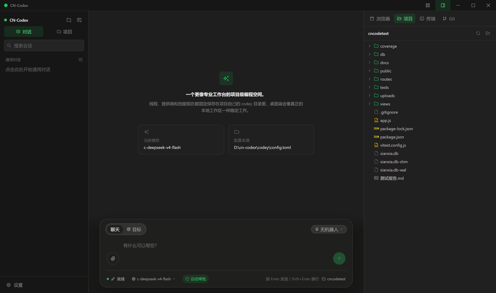
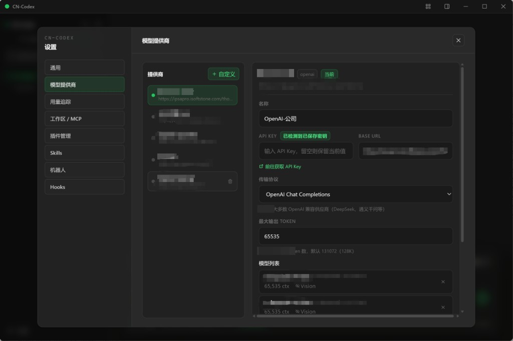
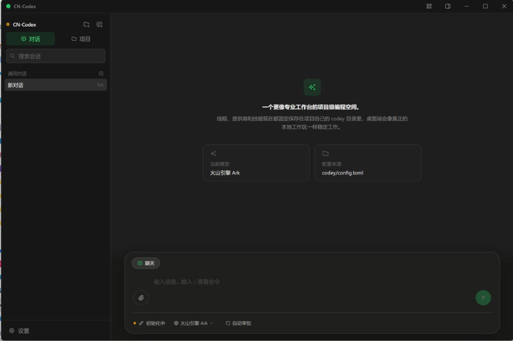

<div align="center">


# CN-Codex

### AI 全栈编程工作台 · 手机遥控 · 机器人流水线 · 本地知识库

**解压即用的桌面 AI Coding Agent**  
手机扫码远程控制 · 机器人自动化协作 · SmartBrain 经验复用 · 50+ 技能 · 50+ 工具 · 12+ 模型供应商

[](https://github.com/longdream/cn-codex/stargazers)
[](https://github.com/longdream/cn-codex/releases)
[](https://github.com/longdream/cn-codex/releases)
[](./LICENSE)
[](https://github.com/longdream/cn-codex/releases)
[](https://v2.tauri.app/)
[](https://github.com/longdream/cn-codex)

[**⬇️ 立即下载**](https://github.com/longdream/cn-codex/releases) ·
[官网介绍](http://47.113.221.244:8081/) ·
[使用指南](http://47.113.221.244:8081/usage.html) ·
[提交 Issue](https://github.com/longdream/cn-codex/issues)

<p>
  <a href="#项目初衷">项目初衷</a> ·
  <a href="#为什么是-cn-codex">为什么选它</a> ·
  <a href="#30-秒上手">快速开始</a> ·
  <a href="#多模型渠道--中转站">多模型 / 中转</a> ·
  <a href="#核心能力">核心能力</a> ·
  <a href="#完整功能地图">完整功能</a> ·
  <a href="#内置工具一览-50">工具清单</a> ·
  <a href="#插件--技能">插件技能</a> ·
  <a href="#技术架构">技术架构</a>
</p>

</div>

<br>

<p align="center">
  
</p>

<p align="center">
  <sub>主界面：多项目侧边栏 · 聊天 / Goal 模式 · 机器人选择 · 文件树 / 终端 / 浏览器面板 · 自动审批</sub>
</p>

---

## 项目初衷

CN-Codex 的出发点很直接：

> **让普通开发者也能长期用上“廉价又好用”的 AI 编程 IDE，而不是被单一官方订阅、高价额度或封闭渠道锁死。**

现实里大家经常碰到这些痛点：

| 痛点 | 现实情况 |
|---|---|
| 官方订阅贵 | 想长期写代码，但官方 coding plan 并不便宜 |
| 免费额度不稳定 | 今天有 free plan，明天可能限流、改规则 |
| 模型渠道分散 | DeepSeek、Grok、Claude、Gemini 各走各的入口 |
| 中转站不好用 | 很多 IDE 只能绑官方 Key，自定义 Base URL / 中转支持很弱 |
| 工具链不完整 | 只能聊天改代码，做不到手机遥控、机器人流水线、经验沉淀 |

### 我们自己怎么用

- **商汤 free coding plan**：当前可以免费试用 **DeepSeek v4 Flash**，拿来做日常全流程开发与回归验证。
- **中转渠道的 Grok 4.5**：长期通过中转站接入，持续“进化”自己的 IDE 能力与工作流。
- **多模型并行**：同一套工作台里，可以同时配置官方源、中转站、本地模型，按任务切换。

### 产品承诺

1. **便宜可用**：优先适配国产高性价比模型，以及各种 free plan / 中转渠道。
2. **渠道自由**：支持自定义 Base URL、API Key、Wire API，天然适合中转站。
3. **能力完整**：不只是聊天壳，而是可遥控、可编排、会积累经验的本地全栈 Agent。
4. **开源透明**：Apache 2.0，解压即用，可二次定制。

一句话：

> **用得起的模型 + 接得上的中转 + 真正能干活的桌面 Agent = CN-Codex。**

---

## 为什么是 CN-Codex？

大多数 AI 编程工具只是“聊天 + 改代码”。  
**CN-Codex 是一台可远程操控、可编排、会积累经验的本地全栈编程工作台。**

| 你真正需要的能力 | CN-Codex 怎么做 |
|---|---|
| 想长期低成本写代码 | 深度适配 DeepSeek v4 Flash，也支持各类 free plan / 中转模型 |
| 想接中转站，不被官方锁死 | 自定义 Base URL / API Key / Wire API，多供应商实例并行 |
| 出门也能盯进度 | 手机扫码远程控制，实时看进度、发指令、审批操作 |
| 复杂任务别靠一个人硬扛 | 机器人 + 子代理并行协作，按工作流节点自动推进 |
| 国产模型真能干活 | 已在 **DeepSeek v4 Flash** 完成全流程开发 / 测试验证 |
| 越用越懂你的项目 | SmartBrain 自动提炼经验与知识，下次直接复用 |
| 不想折腾环境 | 下载 → 解压 → 双击 `CN-Codex.exe`，无需 Node / Python / Docker |
| 想自己改、自己部署 | Apache 2.0 开源，代码透明，可二次定制 |

### 一句话价值

> **把“需求 → 设计 → 编码 → 测试 → 审查 → 部署”整条链路，装进一个可手机遥控的桌面 Agent。**

---

## 亮点速览

```text
💰 廉价好用路线          🔀 多模型 / 中转渠道
📱 手机遥控编程          🤖 机器人自动化流水线
🧠 SmartBrain 知识库      🎯 Goal 自主多步执行
🧩 50+ 内置技能           🛠️ 50+ Agent 工具
🌐 双引擎网页搜索         🎬 浏览器操作录制回放
🔌 MCP / Hooks 扩展       📦 解压即用便携包
```

<p align="center">
  
</p>

---

## 30 秒上手

### 1. 下载启动

从 [GitHub Releases](https://github.com/longdream/cn-codex/releases) 下载最新包，解压后双击：

```text
CN-Codex.exe
```

发布包已内置 `codey/` 运行时（skills / plugins / robots / node）和 `mobile-dist/` 移动端资源。

> Windows 提供两种包：
> - **默认小包（推荐）**：优先使用系统 WebView2，体积更小
> - **fixed WebView2 包**：内置固定 Runtime，适合企业受限环境

### 2. 配置模型（官方 / 中转 / 本地都行）

**设置 → 模型提供商 → 添加供应商**

你可以这样配：

| 场景 | 推荐接法 |
|---|---|
| 商汤 free coding plan | 填对应 Base URL + Key，模型选 DeepSeek v4 Flash |
| DeepSeek 官方 | 预设 DeepSeek，直接填官方 Key |
| 中转 Grok 4.5 / Claude / GPT | 选 OpenAI 兼容或自定义供应商，改 Base URL 为中转地址 |
| 本地模型 | Ollama / LM Studio |
| 多端点容灾 | 同一模型挂多个 endpoint，自动故障转移 |

<p align="center">
  
</p>

### 3. 添加项目并开干

1. 侧边栏点击 **文件夹 +**，选择代码目录  
2. 在聊天框描述需求  
3. 可选：切换 **Goal 模式** 或选择 **机器人** 执行专业化任务  
4. 可选：点标题栏二维码，用手机扫码远程控制

---

## 多模型渠道 · 中转站

CN-Codex 从一开始就按“**多渠道、可中转、可容灾**”设计，而不是只服务某一家官方 API。

### 1) 12+ 供应商预设 + 无限自定义实例

| 供应商 | 说明 |
|---|---|
| **DeepSeek** | v4 Flash 全流程验证（推荐 / free plan 友好） |
| OpenAI | GPT / o 系列，Chat & Responses |
| Anthropic | Claude 系列 |
| Google | Gemini |
| 火山引擎 | Doubao / Ark |
| 通义千问 | Qwen |
| 智谱 | GLM |
| Moonshot | Kimi |
| 硅基流动 | SiliconFlow |
| 百川 | Baichuan |
| Ollama | 本地模型 |
| LM Studio | 本地 GUI 推理 |
| **自定义 / 中转站** | 任意 OpenAI 兼容网关、聚合站、自建反代 |

适配协议：

- OpenAI Chat Completions
- OpenAI Responses
- Anthropic Messages
- Google Gemini

### 2) 为什么特别适合中转

- **自定义 Base URL**：直接填中转地址，例如 `https://your-relay.example/v1`
- **自定义 API Key**：每个供应商实例独立 Key，官方源和中转站可并存
- **自定义模型名**：可填 `grok-4.5`、`deepseek-v4-flash`、`claude-xxx` 等中转模型 ID
- **Wire API 可选**：Chat / Responses / Anthropic / Gemini，兼容不同中转协议
- **同类型多实例**：比如“DeepSeek 官方”“商汤 free plan”“中转站 A”可以同时存在，随时切换
- **本地资源池**：同一模型挂多个 endpoint，502 / 超时自动切换，适合多中转容灾

### 3) 推荐组合（真实用法）

| 用途 | 推荐模型 / 渠道 | 说明 |
|---|---|---|
| 日常写代码 / 修 bug | DeepSeek v4 Flash（商汤 free plan 或官方） | 便宜、快、已全流程验证 |
| 难推理 / 架构设计 | 中转 Grok 4.5 | 适合复杂规划与“进化 IDE”本身 |
| 长文 / 文档 / 审查 | Claude / Gemini 中转或官方 | 按任务挑模型 |
| 离线 / 隐私 | Ollama / LM Studio | 本地推理 |
| 高可用 | 本地资源池多端点 | 主站挂了自动切备用中转 |

### 4) 中转配置示例

1. 设置 → **模型提供商** → **添加供应商**
2. 选 **OpenAI 兼容** 或 **自定义**
3. 填写：
   - **名称**：如 `中转 Grok` / `商汤 DeepSeek`
   - **Base URL**：中转站地址
   - **API Key**：中转 Key
   - **Wire API**：通常选 `chat`
4. 添加模型 ID：如 `grok-4.5` / `deepseek-v4-flash`
5. 激活该供应商，开始对话

> 提示：同类型供应商可以建多个实例。你完全可以一边挂 free plan 的 DeepSeek，一边挂中转 Grok，在输入栏随时切换。

### 5) 本地资源池 / 多端点容灾

适合“多个中转地址互备”：

- 同一模型配置多个 endpoint（URL / Key / Wire API 可不同）
- 活跃端点探测 + 故障标记
- 自动 failover，降低 502 / 超时导致任务中断的风险

---

## 核心能力

### 1) 手机远程控制

扫码连接手机，随时随地掌控 AI 编程助手。

- **实时监控**：查看执行进度、对话记录、工具调用状态
- **远程操作**：发送消息、审批文件/命令、中断或继续任务
- **双重连接**：
  - 局域网直连（低延迟）
  - 公网中转服务器（跨网络访问）
- **安全同步**：WebSocket 实时推送桌面事件到手机

适合通勤、会议间隙、远程协作时“随时接管”开发过程。

### 2) 机器人自动化系统

AI 可创建专业角色，并绑定技能与工作流节点，实现流水线协作。

内置机器人示例：

| 机器人 | 职责 |
|---|---|
| 全栈开发机器人 | 需求 → 设计 → 前后端开发 → 测试 → 审查交付 |
| QA 测试机器人 | 测试策略、用例设计、缺陷复现、测试报告 |
| 需求设计机器人 | 需求澄清、故事建模、交付评审 |

能力点：

- 每个机器人有独立 system prompt、技能集、工作流节点
- 节点级技能绑定（本地 skill + 插件 skill）
- 支持 AI 自动创建 / 更新机器人（`robot_save`）
- 选择机器人后自动进入 Goal 驱动执行

### 3) SmartBrain 经验知识库

基于 LLM Wiki 思路的本地知识系统，让 Agent “越用越聪明”。

- **经验提取**：从历史会话中自动提炼可复用经验
- **知识编译**：结构化 OKF 文档 + 分块索引
- **BM25 检索**：跨经验与知识库统一全文搜索，无需外部向量库
- **上下文桥接**：命中分块后自动补齐前后文，避免断章
- **数据库查询**：`smartbrain_sql_query` 直接查询已配置业务库
- **设置面板**：经验、知识、数据库连接可视化管理

### 4) Goal 自主模式

不是一问一答，而是“给目标就开干”。

- 设置目标后 AI 自主规划多步执行
- 支持 Token 预算控制、暂停 / 恢复
- 自动更新计划（`update_plan`）
- 遇到阻塞可请求用户输入后继续

### 5) 子代理并行引擎

复杂任务自动拆分，多 Agent 并行执行再汇总。

- `spawn_agent` / `wait_agent` / `send_input` / `resume_agent` / `list_agents` / `close_agent`
- 子代理可独立角色、提示词、超时与模型配置
- 适合代码审查、测试、调研、批量改造等并行场景

### 6) 浏览器录制回放 + 自动化

- **内嵌浏览器自动化**（`browser_run`）：导航、点击、输入、截图、DOM 检查
- **外部浏览器 CDP 录制**（`recording_control`）：捕获真实用户操作
- 自动生成可回放工作流 JSON
- 插件 `record-replay` 支持录制生成可复用技能

### 7) 智能网页搜索

- 双引擎：Bing 浏览器搜索 + DuckDuckGo
- 中文问题自动中文关键词优化
- 防循环策略：同一问题最多搜索 3 次
- `web_fetch` 抓取 URL 转可读文本，便于二次分析

### 8) 本地资源池 / 多端点容灾

- 同一供应商可配置多个 API 端点
- 活跃端点探测与故障转移
- 降低 502 / 超时导致的任务中断风险

### 9) 工程工作台

- 多项目侧边栏、通用对话、线程搜索 / 归档 / 分叉
- 右侧 Browser / Project 文件树 / Terminal 三合一
- 内置 PTY 多标签终端
- Diff 预览 + 审批系统（命令 / 文件 / 权限 / 用户提问）
- 自动审批开关（临时覆盖，仍保留“向用户提问”）

### 10) 扩展生态

- 50+ Skills
- 8 大插件：Browser / Computer Use / Documents / Presentations / Spreadsheets / Sites / Record-Replay / Superpowers
- MCP（stdio / HTTP）工具、资源、提示词全链路
- Apps Connectors、Hooks、Skill Lab

---

## 完整功能地图

<details open>
<summary><strong>点击展开 / 收起完整功能表</strong></summary>

<br>

| 类别 | 功能 | 说明 |
|---|---|---|
| 成本与渠道 | 廉价模型路线 | DeepSeek v4 Flash 验证；适合 free plan / 高性价比模型 |
| 成本与渠道 | 多供应商实例 | 官方源、中转站、本地模型可并存，随时切换 |
| 成本与渠道 | 中转友好配置 | 自定义 Base URL / Key / 模型 ID / Wire API |
| 成本与渠道 | 本地资源池 | 多端点活跃探测与故障转移 |
| 对话系统 | 多轮聊天 | 流式输出、Markdown、代码高亮、会话搜索 / 归档 / 分叉 |
| 对话系统 | Goal 模式 | 目标驱动多步执行，支持预算与暂停恢复 |
| 对话系统 | 斜杠命令 | `/help` `/model` `/approval` `/clear` `/compact` `/history` `/plan` 等 |
| 对话系统 | 附件能力 | 文本/图片附件、拖拽上传、视觉模型图片理解 |
| 工程能力 | 文件读写补丁 | `read_file` / `write_file` / `apply_patch` / 目录浏览 |
| 工程能力 | Shell 执行 | 一次性命令 + 持久交互会话（exec/write_stdin/close） |
| 工程能力 | 代码审查 | `code_review` 审查 diff / 风险点 / 缺测问题 |
| 工程能力 | Git 面板 | 变更查看、分支信息、仓库状态联动 |
| 工程能力 | Diff 预览 | 补丁 diff 可视化，审批前确认改动 |
| UI 工作台 | 多项目侧边栏 | 项目分组、通用对话、线程搜索 |
| UI 工作台 | 右侧面板 | Browser / Project 文件树 / Terminal 三合一 |
| UI 工作台 | 内置终端 | 基于 PTY 的多标签交互终端 |
| UI 工作台 | 审批系统 | 命令、文件、权限、用户提问四类审批 |
| UI 工作台 | 自动审批开关 | 临时覆盖策略，仍保留“向用户提问” |
| 自动化 | 机器人系统 | 角色 + 技能 + 工作流节点编排 |
| 自动化 | 子代理 | 并行拆分任务并汇总结果 |
| 自动化 | Hooks | Agent 生命周期钩子，可阻断 / 注入上下文 |
| 自动化 | 工作流 | 从对话提取工作流，录制回放可复用 |
| 知识系统 | SmartBrain | 经验提取、知识索引、BM25 检索、SQL 查询 |
| 知识系统 | Memory | 跨会话记忆 list/read/search/write/update/forget |
| 知识系统 | 用户 / 项目规则 | Markdown 规则自动注入 system prompt |
| 浏览器 | 内嵌自动化 | `browser_run` 完整动作序列 |
| 浏览器 | 外部录制 | CDP 录制点击/输入/导航并生成工作流 |
| 网络能力 | 网页搜索 | Bing + DuckDuckGo 双引擎 |
| 网络能力 | 内容抓取 | `web_fetch` |
| 多模态 | OCR | 本地 PP-OCR（ONNX）识别图片文字 |
| 多模态 | 图像生成 | OpenAI Images 兼容接口 |
| 多模态 | 图表报告 | `echarts_report` 生成可渲染图表配置 |
| 扩展生态 | Skills | 50+ 内置技能，可启用/禁用 |
| 扩展生态 | Plugins | Browser / Computer Use / Docs / PPT / Sheets / Sites / Superpowers / Record-Replay |
| 扩展生态 | MCP | stdio/HTTP MCP 服务器，工具/资源/提示词全链路 |
| 扩展生态 | Apps Connectors | 插件声明的 App 连接器与可信工具 |
| 扩展生态 | Skill Lab | 技能实验与回归验证面板 |
| 运维与体验 | 用量统计 | SQLite 记录 Token，按日/模型统计 |
| 运维与体验 | 自动更新 | 发布包版本检查与更新链路 |
| 运维与体验 | 中英双语 | 默认中文，运行时切换英文 |
| 运维与体验 | 主题外观 | 深色 / 浅色 / 跟随系统 + 自定义背景 |
| 移动端 | 手机遥控 | 扫码连接、实时同步、远程审批 |
| 移动端 | 中继服务 | 公网跨网访问（`relay-server`） |
| 发布 | 便携包 | normal 小包 / fixed WebView2 大包双轨发布 |

</details>

---

## 内置工具一览（50+）

AI 会根据任务自动调用这些工具，无需你手写脚本拼流程。

### 文件与工程

| 工具 | 作用 |
|---|---|
| `read_file` / `write_file` / `list_directory` | 读写文件、浏览目录 |
| `apply_patch` | 多文件增删改补丁 |
| `code_review` | 审查当前变更与风险 |
| `update_plan` | 更新多步骤任务计划 |
| `request_user_input` / `request_permissions` | 向用户确认与申请权限 |

### 命令执行

| 工具 | 作用 |
|---|---|
| `shell` / `shell_command` | 一次性命令执行 |
| `exec_command` | 启动持久会话 |
| `write_stdin` / `close_exec_session` | 交互输入与关闭会话 |

### 浏览器 / 录制 / 搜索

| 工具 | 作用 |
|---|---|
| `browser_run` | 内嵌浏览器自动化 |
| `recording_control` | 外部浏览器录制控制 |
| `web_search` / `web_fetch` | 搜索与抓取网页 |

### 子代理

| 工具 | 作用 |
|---|---|
| `spawn_agent` | 启动后台子代理 |
| `wait_agent` / `list_agents` | 等待 / 查看状态 |
| `send_input` / `resume_agent` / `close_agent` | 通信、恢复、关闭 |

### 记忆 / 知识 / 机器人

| 工具 | 作用 |
|---|---|
| `memory_*` | 跨会话记忆管理 |
| `smartbrain_search` | 统一知识检索 |
| `smartbrain_sql_query` | 查询已配置数据库 |
| `robot_save` | 创建或更新机器人 |

### MCP / 插件 / 多模态

| 工具 | 作用 |
|---|---|
| `mcp_list_*` / `mcp_call_tool` / `mcp_get_prompt` | MCP 全链路调用 |
| `tool_search` / `apps_list` / `plugin_manage` | 工具与插件发现管理 |
| `view_image` / `ocr_image` / `image_generate` | 看图、OCR、生图 |
| `echarts_report` | 生成交互图表配置 |

---

## 插件 & 技能

### 8 大插件

| 插件 | 能力 |
|---|---|
| **Browser** | 内嵌浏览器控制、页面自动化与验证 |
| **Computer Use** | Windows 桌面应用操控 |
| **Documents** | Word / Docs 文档创建、修订、渲染验收 |
| **Presentations** | PPTX 演示文稿生成 |
| **Spreadsheets** | Excel / CSV 分析、公式、图表 |
| **Sites** | 站点构建与托管工作流 |
| **Record & Replay** | 录制浏览器操作并生成可回放技能 |
| **Superpowers** | TDD、调试、计划、审查、并行开发方法论 |

### 50+ 内置技能（部分）

- 工程：`code-review`、`systematic-debugging`、`test-driven-development`、`writing-plans`、`deploy-pipeline`
- 质量：`api-testing`、`security-testing`、`performance-testing`、`test-case-design`、`webapp-testing`
- 协作：`babysit-pr`、`gh-fix-ci`、`prd-story-modeler`、`requirements-intake`
- 生态：`mcp-builder`、`skill-creator`、`smartbrain-context-read`、`dingtalk-document`
- 创意：`novel-claude`、`design-automation`、`awesome-design-md`、`batch-production`

> 另含插件技能（Browser / Computer Use / Documents / Presentations / Spreadsheets / Sites / Record-Replay / Superpowers），合计 50+。

> 可在 **设置 → Skills / Plugins / Skill Lab** 中启用、禁用、实验与管理。

---

## 界面能力一览

<p align="center">
  
</p>

- **标题栏**：窗口控制、二维码连接、状态灯
- **侧边栏**：项目、通用对话、搜索、设置入口
- **聊天区**：消息流、工具卡片、计划卡片、补丁预览
- **输入区**：模式切换、机器人选择、附件、自动审批、模型切换
- **右侧面板**：
  - Browser：内嵌浏览与自动化
  - Project：文件树、右键加入对话
  - Terminal：多标签真实终端
- **设置中心**：供应商 / 图像生成 / 用量 / MCP / 插件 / Skills / Skill Lab / 机器人 / 工作流 / SmartBrain / 规则 / 通用

---

## 技术架构

```text
React + Zustand + Tailwind
            │ Tauri IPC / Events
            ▼
Rust Agent Engine
  ├─ ToolExecutor（50+ 工具）
  ├─ Subagent Engine
  ├─ SmartBrain（经验 + 知识 + SQL）
  ├─ Robot / Workflow / Hook Runtime
  ├─ Browser Automation + CDP Recording
  ├─ MCP Client（stdio / HTTP）
  ├─ Local Pool（多端点容灾）
  └─ LLM Adapter（多协议 / 中转友好）
            │
            ▼
官方 API / 中转站 / DeepSeek / Grok / Claude / 本地模型 ...
```

| 层级 | 技术 |
|---|---|
| 桌面框架 | Tauri v2 |
| 后端 | Rust（Edition 2024） |
| 前端 | React 18 + TypeScript + Vite 6 |
| 样式 | Tailwind CSS 4 |
| 状态 | Zustand |
| 国际化 | react-intl |
| 存储 | SQLite + JSONL sessions |
| OCR | PP-OCR + ONNX Runtime |
| 移动端 | 独立 mobile-web + WebSocket |

### 本地数据落盘（便携可迁移）

```text
codey/
├── config.toml          # 配置
├── sessions/            # 会话 JSONL
├── skills/ plugins/ robots/
├── memories/            # 记忆与知识
├── workflows/ recordings/
└── usage.db             # 用量统计
```

---

## 对比：为什么值得 Star

| 维度 | 普通 AI Chat | 常见 CLI Agent | **CN-Codex** |
|---|---|---|---|
| 桌面可视化工作台 | 弱 | 无 | ✅ |
| 廉价模型 / free plan | 一般 | 一般 | ✅ DeepSeek 验证 |
| 中转站 / 自定义渠道 | 弱 | 有限 | ✅ 原生支持 |
| 手机远程控制 | 少见 | 无 | ✅ |
| 机器人工作流编排 | 少见 | 有限 | ✅ |
| 本地经验知识库 | 少见 | 有限 | ✅ SmartBrain |
| 浏览器录制回放 | 少见 | 少见 | ✅ |
| 子代理并行 | 部分有 | 部分有 | ✅ |
| MCP / Hooks / Skills 生态 | 部分有 | 部分有 | ✅ 全家桶 |
| 解压即用 | 看产品 | 通常要环境 | ✅ |

如果你在找“能真正落地全流程开发”的本地 Agent，而不是只能聊天的壳，CN-Codex 值得你先点一个 Star 再慢慢玩。

---

## 典型使用场景

1. **低成本日常开发**  
   商汤 free plan / DeepSeek v4 Flash 写代码、改 bug、跑回归。

2. **中转强模型攻坚**  
   用中转 Grok 4.5 做架构设计、复杂重构、IDE 自身进化。

3. **全栈项目从 0 到 1**  
   选“全栈开发机器人”，从需求文档一路做到测试交付。

4. **已有仓库重构 / 修 Bug**  
   Goal 模式 + `code_review` + 子代理并行排查。

5. **测试与质量保障**  
   QA 机器人 + 浏览器自动化 + 录制回放回归。

6. **知识沉淀型团队**  
   SmartBrain 自动沉淀经验，新人接手也能快速上手。

7. **远程协作**  
   电脑在跑任务，手机扫码随时审批与纠偏。

---

## 开发与发布（贡献者）

### 本地开发

```bash
# 安装依赖
pnpm install

# 开发启动（示例）
pnpm tauri dev
```

### 便携包发布

```bat
scripts\release-portable.bat
scripts\release-portable.bat --fixed
```

- `normal`：默认小包  
- `fixed`：内置 fixed WebView2 大包  

版本唯一来源：`src-tauri/Cargo.toml` 的 `version`。

---

## 文档

- [下载最新版本](https://github.com/longdream/cn-codex/releases)
- [官方网站](http://47.113.221.244:8081/)
- [使用指南](http://47.113.221.244:8081/usage.html)
- [架构说明](./docs/architecture.md)
- [需求规格](./docs/requirements.md)

---

## Roadmap（欢迎一起推动）

- [ ] 更完整的跨平台支持（macOS / Linux）
- [ ] 更强的团队协作与共享知识库
- [ ] 更丰富的机器人市场与技能市场
- [ ] 更细粒度的安全沙箱策略
- [ ] 更完善的自动评测与回归体系
- [ ] 更完善的中转站预设与一键导入模板

有想法？欢迎提 [Issue](https://github.com/longdream/cn-codex/issues) 或 PR。

---

## Star History

<a href="https://star-history.com/#longdream/cn-codex&Date">
 <picture>
   <source media="(prefers-color-scheme: dark)" srcset="https://api.star-history.com/svg?repos=longdream/cn-codex&type=Date&theme=dark" />
   <source media="(prefers-color-scheme: light)" srcset="https://api.star-history.com/svg?repos=longdream/cn-codex&type=Date" />
   
 </picture>
</a>

---

## 致谢

本项目灵感来源于 [OpenAI Codex](https://github.com/openai/codex) CLI/TUI，在此致谢。  
也感谢所有提交 Issue、PR、分享使用反馈的开发者。

## 开源协议

[Apache License 2.0](./LICENSE)

---

<div align="center">

### 如果 CN-Codex 对你有帮助，请给一个 Star ⭐

这是对开源项目最直接的支持，也能让更多开发者看到它。

[](https://github.com/longdream/cn-codex)

**手机在手，代码我有。**  
**用得起的模型，接得上的中转，干得完的活。**

[⬇️ 立即下载](https://github.com/longdream/cn-codex/releases) ·
[📖 使用指南](http://47.113.221.244:8081/usage.html) ·
[💬 讨论区](https://github.com/longdream/cn-codex/discussions)

</div>
