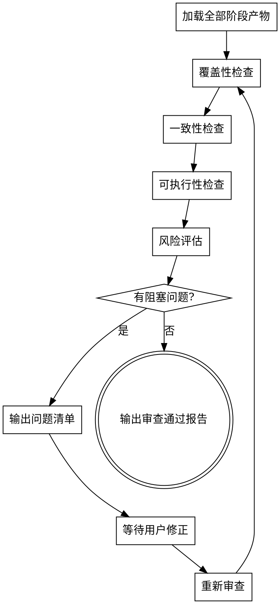

# PRD 交付审查

对整合后的 PRD 进行多维度质量审查，确保文档完整、一致、可执行，达到交付标准。

## 核心原则

- **证据驱动**: 每个审查结论都要引用具体文档位置
- **不放过模糊**: 任何模棱两可的表述都是缺陷
- **不自行补全**: 发现缺失时标记为问题，不替用户决定

## 审查流程



## 四维度审查

### 1. 覆盖性检查

逐条对照，确保无遗漏：

| 来源 | 目标 | 检查方式 |
|------|------|----------|
| intake 功能 (F-xxx) | 用户故事 (US-xxx) | 每个 F-xxx 至少有一个 US-xxx 对应 |
| 用户故事 (US-xxx) | 功能需求 (FR-xxx) | 每个 US-xxx 至少有一个 FR-xxx 对应 |
| 用户故事 (US-xxx) | 验收标准 | 每个 US-xxx 至少有 2 个验收标准 |
| intake 约束 | PRD 约束章节 | 技术/业务约束均已体现 |
| intake 非目标 | PRD 非目标章节 | Non-Goals 完整继承 |

**输出**: 覆盖矩阵 + 未覆盖项清单

### 2. 一致性检查

检查文档内部和跨文档的一致性：

- **术语一致**: 同一概念在所有文档中使用相同名称（如"用户"vs"客户"vs"使用者"）
- **编号一致**: US/FR 编号无重复、无跳号
- **角色一致**: 用户故事中的角色与 intake 中的目标用户一致
- **范围一致**: 功能需求未超出 intake 确认的范围（不能自行膨胀）
- **流程一致**: 交互流程图中的步骤与用户故事一一对应

**输出**: 不一致项清单（含位置引用）

### 3. 可执行性检查

确保开发团队能直接基于 PRD 工作：

- **验收标准可验证**: 用"是/否"判定，无模糊词（正常、合理、适当、良好、友好）
- **功能需求无歧义**: 每条 FR 只有一种解读方式
- **流程无死路**: 每个流程分支都有明确的终点或跳转目标
- **错误场景覆盖**: 核心流程的异常路径已定义
- **数据定义清晰**: 涉及的数据字段有类型、约束、默认值说明

**输出**: 可执行性问题清单

### 4. 风险评估

- **未决事项**: 是否仍有 `Decision needed` 状态的待决项
- **假设风险**: 标记为 `Assumption` 的项是否可能导致返工
- **依赖风险**: 是否依赖外部系统、第三方服务
- **规模风险**: 功能范围是否超出单次迭代的合理规模

**输出**: 风险等级评定 + 建议

## 问题严重度分级

| 等级 | 含义 | 处理方式 |
|------|------|----------|
| **阻塞** | 缺失核心需求、存在矛盾、无法交付 | 必须修正后才能继续 |
| **重要** | 验收标准模糊、流程有缺口 | 强烈建议修正 |
| **建议** | 文档格式、表述优化 | 可选修正 |

## 审查报告模板

```markdown
# {Feature Name} — PRD 审查报告

## 审查概要

- 审查日期: {YYYY-MM-DD}
- 审查文档: 00-intake.md, 01-boundary.md, 02-stories.md, 03-flows.md, 04-delivery-prd.md
- 审查结论: **通过** / **有条件通过（N 个重要问题）** / **未通过（N 个阻塞问题）**

## 覆盖性
- intake 功能覆盖率: {N}/{M} ({百分比})
- 未覆盖项: {列表或"无"}

## 一致性
- 发现不一致: {N} 项
- {问题描述 + 位置引用}

## 可执行性
- 模糊验收标准: {N} 项
- 流程缺口: {N} 项
- 缺失错误场景: {N} 项

## 风险
- 未决事项: {N} 项
- 高假设风险: {N} 项
- 依赖风险: {列表}

## 问题清单

| 编号 | 严重度 | 类别 | 问题描述 | 位置 | 建议 |
|------|--------|------|----------|------|------|
| RV-001 | 阻塞 | 覆盖性 | ... | 02-stories.md | ... |
| RV-002 | 重要 | 可执行性 | ... | 03-flows.md | ... |

## 结论

{通过/未通过的说明，以及下一步建议}
```

## 审查通过标准

全部满足时 PRD 视为审查通过：
- [ ] 零阻塞问题
- [ ] 覆盖率 100%（每个 intake 功能都有对应故事和需求）
- [ ] 零模糊验收标准
- [ ] 所有 `Decision needed` 项已解决或标记为非阻塞
- [ ] 用户已确认审查报告

未通过时，将问题清单返回给用户，等待修正后重新审查。
