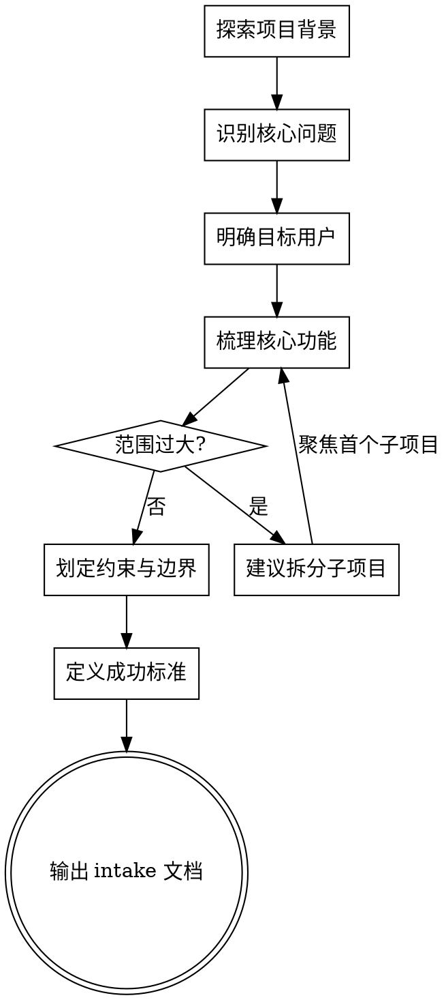

# 需求采集与理解

将模糊的产品想法转化为结构化的需求描述。通过渐进式问答引导用户厘清核心需求。

<HARD-GATE>
在用户确认需求采集结果之前，不得进入用户故事编写、功能设计、交互设计或任何实现环节。
</HARD-GATE>

## 核心原则

- **一次只问一个问题**，不用问卷轰炸用户
- **优先提供多选项**（A/B/C/D），用户可快速回复字母
- **标记不确定性**：每个信息点标记为 `Fact` / `Assumption` / `Risk` / `Decision needed` / `Out of scope`
- **渐进深入**：先确认大方向，再细化约束

## 采集流程



## 五维度采集框架

### 1. 问题与目标
- 要解决什么问题？现状是什么？
- 为什么现在要做？有什么触发因素？
- 做完之后期望达到什么效果？

### 2. 目标用户
- 主要用户是谁？（角色、场景、频率）
- 有哪些次要用户或利益相关方？
- 用户当前如何解决这个问题？（替代方案）

### 3. 核心功能
- 必须有的核心能力是什么？（MVP 范围）
- 哪些功能可以后续版本再做？
- 有没有参考产品或竞品？

### 4. 约束与边界
- 技术约束（现有系统、技术栈、性能要求）
- 业务约束（合规、时间节点、预算）
- 明确不做什么（Out of scope）

### 5. 成功标准
- 用什么指标衡量成功？（可量化）
- 验收标准是什么？谁来验收？
- 上线后如何监控效果？

## 提问格式

每个问题使用以下格式，用户可回复字母快速选择：

```
[问题描述]
A. 选项一
B. 选项二
C. 选项三
D. 其他（请说明）
```

当问题不适合多选时，使用开放式提问，但限定回答范围：

```
请用 1-2 句话描述 [具体方面]。
```

## 不确定性标记规则

在整理采集结果时，对每条信息标注确定性状态：

| 标记 | 含义 | 处理方式 |
|------|------|----------|
| `Fact` | 用户明确确认的事实 | 直接纳入需求 |
| `Assumption` | 合理推断，用户未明确否认 | 标注并继续，后续验证 |
| `Risk` | 可能影响项目的不确定因素 | 记录并在审查阶段评估 |
| `Decision needed` | 需要用户或利益方决策 | 不得自行假设，必须等待决策 |
| `Out of scope` | 明确排除的内容 | 记录在非目标清单 |

## 范围过大判断标准

当出现以下信号时，建议拆分子项目：
- 涉及 3 个以上独立子系统
- 需要多个团队协作交付
- 预估开发周期超过 3 个月
- 存在多个独立的用户角色各有复杂流程

拆分时帮用户识别独立模块、模块间依赖关系、建议的优先级排序，然后聚焦第一个子项目继续采集。

## 产出文档模板

采集完成后，保存到 `docs/prd-workspace/{feature}/00-intake.md`：

```markdown
# {Feature Name} — 需求采集记录

## 项目背景
[1-3 句话描述背景和触发因素]

## 核心问题
[要解决的问题和期望效果]

## 目标用户
| 用户角色 | 使用场景 | 使用频率 | 确定性 |
|----------|----------|----------|--------|
| ... | ... | ... | Fact/Assumption |

## 核心功能清单
| 编号 | 功能 | 优先级 | 确定性 |
|------|------|--------|--------|
| F-001 | ... | 必须/期望/可选 | Fact/Assumption |

## 约束条件
- 技术约束: ...
- 业务约束: ...
- 时间约束: ...

## 非目标 (Out of Scope)
- ...

## 成功标准
| 指标 | 目标值 | 衡量方式 |
|------|--------|----------|
| ... | ... | ... |

## 待决事项
| 编号 | 问题 | 状态 | 影响范围 |
|------|------|------|----------|
| D-001 | ... | Decision needed | ... |

## 风险清单
| 编号 | 风险 | 影响 | 缓解措施 |
|------|------|------|----------|
| R-001 | ... | ... | ... |
```

## 完成门禁

采集完成前必须满足：
- [ ] 五个维度均已覆盖（可以有 Assumption，但不能有空白维度）
- [ ] 至少 3 个核心功能已识别
- [ ] 非目标清单已明确
- [ ] 所有 `Decision needed` 项已向用户确认或标记为阻塞项
- [ ] 用户已确认采集结果无遗漏

确认后告知用户："需求采集完成，文档已保存到 `{path}`。接下来将进入业务边界划定阶段。"
