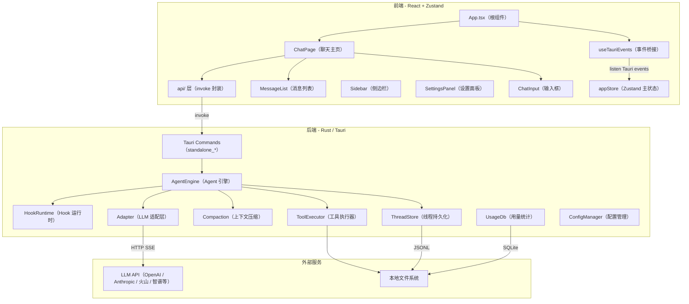
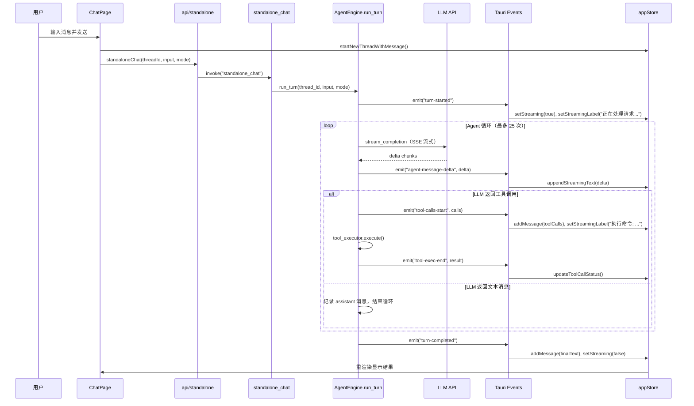
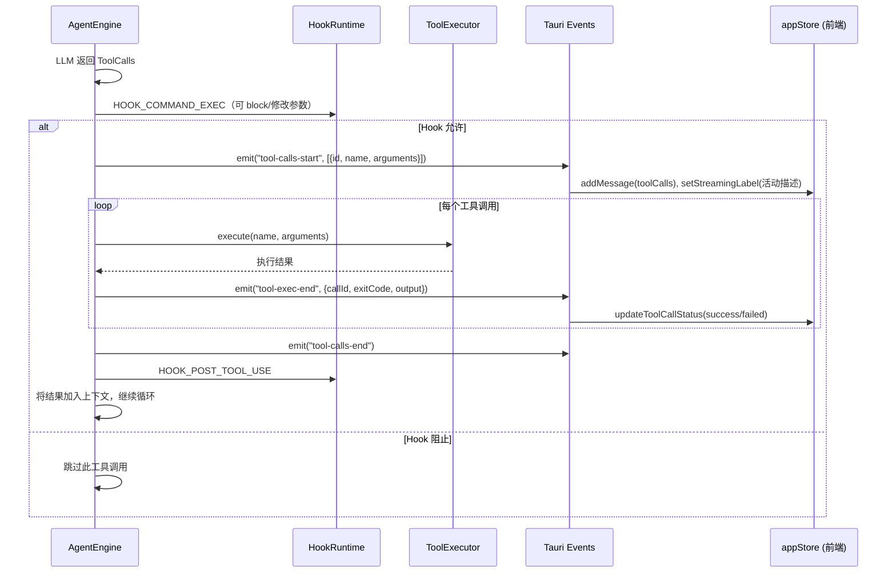
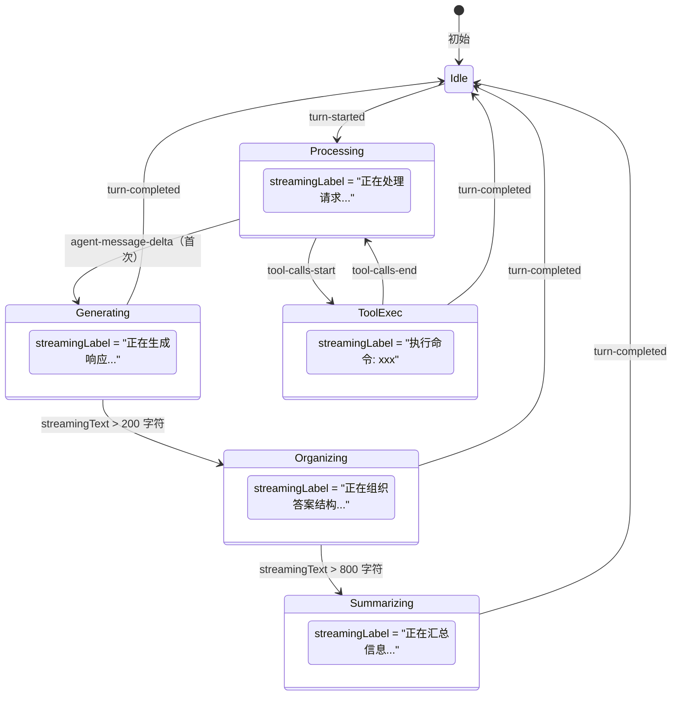
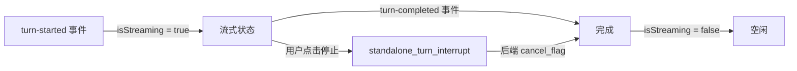
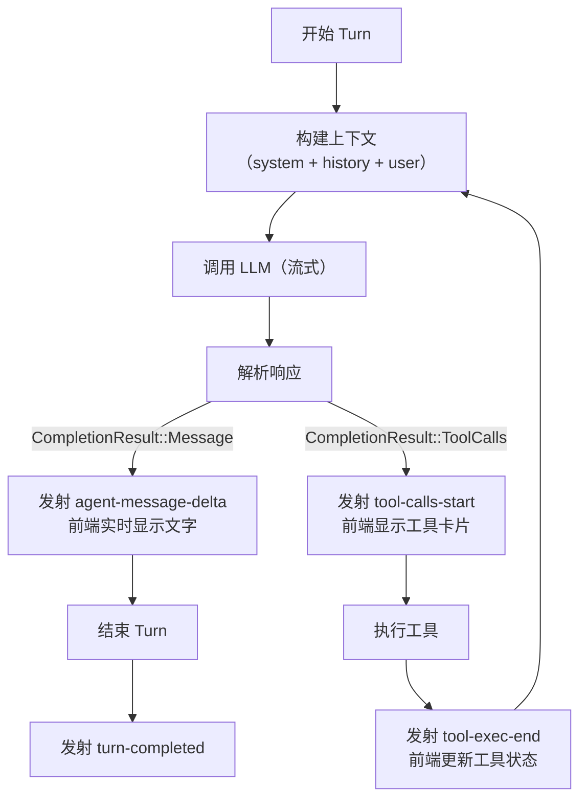
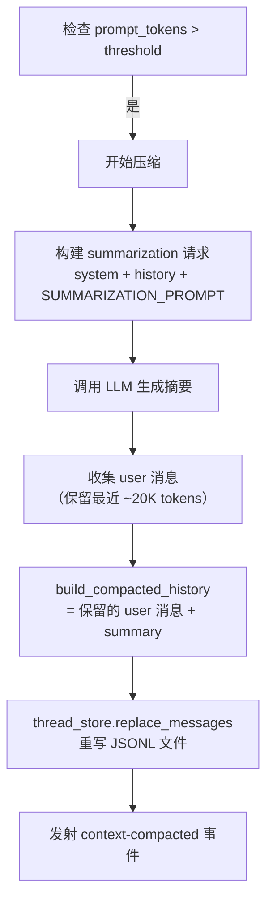

# CN-Codex 技术架构文档

## 项目概述

CN-Codex 是一个基于 **Tauri 2 + React** 的 AI 编程助手桌面应用。前端使用 React + Zustand + TailwindCSS，后端使用 Rust（Tauri 框架），内置 Agent 引擎支持多轮对话、工具调用、上下文压缩等能力。

## 整体架构



## 目录结构

```
cn-codex/
├── src/                          # 前端 React 源码
│   ├── main.tsx                  # React 入口
│   ├── App.tsx                   # 根组件（布局 + 初始化）
│   ├── api/                      # Tauri invoke 封装
│   │   ├── standalone.ts         # 核心引擎调用（thread/chat/config）
│   │   ├── app_state.ts          # SQLite KV 持久化
│   │   ├── approval.ts           # 审批通道
│   │   └── ...
│   ├── stores/                   # Zustand 状态管理
│   │   ├── appStore.ts           # 主应用状态（~1300 行）
│   │   └── settingsStore.ts      # 语言/主题
│   ├── hooks/
│   │   └── useTauriEvents.ts     # 后端事件 → store 桥接
│   ├── components/
│   │   ├── chat/                 # 聊天 UI
│   │   ├── layout/               # 布局组件
│   │   ├── settings/             # 设置面板
│   │   ├── approval/             # 审批弹窗
│   │   └── common/               # 通用组件
│   ├── types/                    # TypeScript 类型定义
│   └── i18n/                     # 国际化（中/英）
├── src-tauri/                    # Rust 后端
│   ├── src/
│   │   ├── lib.rs                # 模块声明 + Tauri 初始化
│   │   ├── agent.rs              # Agent 引擎核心
│   │   ├── thread_store.rs       # 线程/会话持久化
│   │   ├── compaction.rs         # 上下文压缩
│   │   ├── tool_executor.rs      # 工具执行器
│   │   ├── standalone.rs         # Standalone 命令
│   │   ├── config_system.rs      # 配置管理
│   │   ├── hook_runtime.rs       # Hook 运行时
│   │   ├── browser_automation.rs # 浏览器自动化
│   │   ├── adapter/              # LLM 适配层
│   │   ├── commands/             # Tauri 命令
│   │   ├── protocol/             # JSON-RPC 协议类型
│   │   └── usage/                # 用量统计
│   ├── Cargo.toml
│   └── tauri.conf.json
├── codey/                        # 运行时资源
│   ├── config.toml               # 用户配置
│   ├── sessions/                 # 会话持久化（JSONL）
│   ├── skills/                   # Skill 定义
│   ├── plugins/                  # 插件
│   └── memories/                 # 记忆存储
├── docs/                         # 技术文档
└── publish.bat                   # Windows 发布脚本
```

## 核心数据流

### 用户发送消息



### 工具调用详细流程



## 状态管理设计

### appStore 核心状态分组

| 分组 | 字段 | 说明 |
|------|------|------|
| **初始化** | `initialized`, `initError`, `retryInit` | 应用启动状态 |
| **当前会话** | `currentThreadId`, `currentTurnId` | 活跃线程和 turn |
| **消息** | `messages`, `streamingText`, `streamingLabel`, `isStreaming` | 聊天消息和流式状态 |
| **模式** | `chatMode`（chat/goal）, `currentGoal` | 对话模式 |
| **模型** | `configuredModels`, `activeModelId`, `providers`, `activeProviderId` | 模型配置 |
| **工作区** | `workspaceCwd`, `configDir`, `configPath` | 路径 |
| **项目/线程** | `projects`, `currentProjectId`, `threads`, `threadProjectMap` | 多项目管理 |
| **UI** | `showSettings`, `rightPanelVisible`, `autoApprove` | 界面状态 |

### 状态流转：流式输出阶段



## 完成状态判断机制

### Turn 完成的判断

Agent 引擎通过以下条件判断一个 turn 是否完成：

1. **LLM 返回纯文本消息**（非工具调用）→ turn 结束
2. **循环次数达到上限**（25 次）→ 强制结束
3. **用户中断**（`cancel_flag` 被设置）→ 中断结束
4. **Goal 模式下 Goal 完成**（agent 标记 goal 为 completed）→ 结束

### 前端如何感知完成



前端通过监听 `turn-completed` 事件来判断处理完成：

| 事件 | 前端动作 |
|------|----------|
| `turn-started` | `isStreaming = true`，显示加载动画 |
| `agent-message-delta` | 累积文本，实时显示 |
| `tool-calls-start` | 显示工具调用卡片 |
| `tool-exec-end` | 更新工具状态为成功/失败 |
| `turn-completed` | `isStreaming = false`，将累积文本转为正式消息 |

### 错误与取消

- **后端错误**：`standalone_chat` 返回 `Err` → 前端 catch → 显示错误 toast
- **用户取消**：前端调用 `standalone_turn_interrupt` → 后端设置 `cancel_flag` + 中断活跃工具 → `turn-completed` 事件携带中断信息
- **Goal 模式错误**：自动将 goal 状态恢复为 `paused`

## 文本 + 工具输出的实现原理

### 为什么输出是"文字 + 工具调用"交替出现

LLM 的输出天然分为两种：

1. **文本内容**（assistant message）：模型的思考和回复
2. **工具调用**（function call / tool_use）：模型决定执行的操作

Agent 引擎的循环实现了这种交替：



### 流式文本输出

```rust
// agent.rs 中 stream_completion 的核心逻辑
while let Some(chunk) = stream.next().await {
    // 解析 SSE delta
    if let Some(content_delta) = parse_delta(&chunk) {
        // 实时发射给前端
        app_handle.emit("agent-message-delta", json!({ "delta": content_delta }));
        full_content.push_str(&content_delta);
    }
}
```

前端 `useTauriEvents.ts` 接收并累积：

```typescript
listen("agent-message-delta", (e) => {
    store.appendStreamingText(e.payload.delta);
    // streamingText 实时更新 → MessageList 重渲染
});
```

### 工具调用卡片

工具调用以 `ChatMessage` 的形式存储，包含 `toolCalls` 数组：

```typescript
interface ToolCallItem {
    id: string;
    name: string;           // 工具名（如 "shell"）
    arguments: string;      // JSON 参数
    status: "running" | "success" | "failed";
    displayLabel: string;   // 显示文本（如 "ls -la"）
    output?: string;        // 执行输出
}
```

`MessageList` 对包含 `toolCalls` 的消息渲染为可折叠的工具卡片 UI。

## 上下文压缩（Compaction）

### 触发时机

| 时机 | 条件 |
|------|------|
| **Pre-turn** | turn 开始前，检查上次 `last_single_prompt_tokens` > 阈值 |
| **Mid-turn** | 工具调用后，单次 API prompt_tokens > 阈值 |
| **Goal continuation** | goal 循环继续前检查 |
| **手动** | 用户输入 `/compact` |

### 阈值计算

```rust
pub fn compact_threshold(config: &ConfigToml) -> u64 {
    // 优先使用显式配置
    if let Some(limit) = config.model_auto_compact_token_limit {
        return limit;
    }
    // 否则取模型上下文窗口的 90%
    let window = config.model_context_window.unwrap_or(128_000);
    (window as f64 * 0.9) as u64
}
```

### 压缩流程



## 持久化设计

### 线程持久化（JSONL Rollout）

每个线程存储为 `codey/sessions/{thread_id}.jsonl`，每行一个事件：

| 事件类型 | 内容 |
|----------|------|
| `thread_meta` | 线程元信息（name、创建时间） |
| `thread_goal_set` | Goal 设置 |
| `turn_start` | Turn 开始（id、mode） |
| `message` | 单条消息（role、content） |
| `turn_end` | Turn 结束（usage、changed_files） |
| `thread_update` | 线程属性更新 |

### KV 持久化（SQLite）

`codey/usage.db` 中的 `app_state` 表存储前端持久化数据：

- 供应商配置、模型列表
- 项目关联、活跃模型
- UI 偏好（auto_approve、theme、locale）

## LLM 适配层

支持多种 LLM API 格式：

| 适配器 | wire_api | 支持的服务 |
|--------|----------|-----------|
| `ChatCompletions` | `chat` | OpenAI、火山引擎、智谱、百度 |
| `Responses` | `responses` | OpenAI Responses API |
| `Anthropic` | `anthropic` | Claude |
| `Google` | `google` | Gemini |

所有适配器统一输出 `CompletionResult`：

```rust
enum CompletionResult {
    Message {
        content: String,
        usage: TokenUsage,
    },
    ToolCalls {
        calls: Vec<ToolCallRequest>,
        usage: TokenUsage,
    },
}
```

## 技术栈

### 前端

| 技术 | 版本 | 用途 |
|------|------|------|
| React | 18.3 | UI 框架 |
| Zustand | latest | 状态管理 |
| TailwindCSS | 4 | 样式 |
| Vite | 6 | 构建工具 |
| TypeScript | 5.7 | 类型系统 |
| react-intl | latest | 国际化 |
| react-markdown | latest | Markdown 渲染 |
| Vitest | 4.1 | 单元测试 |

### 后端

| 技术 | 版本 | 用途 |
|------|------|------|
| Rust | 1.85+ | 系统语言 |
| Tauri | 2 | 桌面框架 |
| tokio | full | 异步运行时 |
| reqwest | latest | HTTP 客户端 |
| rusqlite | bundled | SQLite |
| serde/serde_json | latest | 序列化 |
| tracing | latest | 日志 |

## 发布流程

通过 `scripts/release-portable.bat`（x64 免安装包，双轨发布）：

### normal 模式（默认，小包）

1. 执行 Tauri Release 构建（`pnpm tauri build --no-bundle`）
2. 复制产物：`CN-Codex.exe` + 依赖 DLL
3. 复制 OCR 运行时资源：`src-tauri/resources/ocr/` -> `publish/resources/ocr/`
4. 校验 OCR 关键文件（det/rec/vocab/onnxruntime）已进入 `publish/resources/ocr/`
5. 打包 `codey/` 运行时资源（skills/plugins/robots/node）并清理敏感文件（如 `usage.db` / `config.toml`）
6. 打包 `mobile-dist/` 移动端静态资源
7. 输出 ZIP：`CN-Codex-portable-x64-<appVersion>.zip`

### fixed 模式（`--fixed`，大包）

1. 读取固定 WebView2 版本：`release/webview2-runtime.version`
2. 解析 Fixed Runtime 包来源（优先本地 CAB，其次 `release/webview2-runtime.url`，也可命令行传参）
3. 解压到 `publish/webview2-fixed-runtime/<version>/`
4. 执行 Tauri Release 构建（`pnpm tauri build --no-bundle`）
5. 复制产物：`CN-Codex.exe` + 依赖 DLL + 调试符号
6. 复制 `webview2-runtime.version` 到发布目录用于核对
7. 复制 OCR 运行时资源：`src-tauri/resources/ocr/` -> `publish/resources/ocr/`
8. 校验 OCR 关键文件（det/rec/vocab/onnxruntime）已进入 `publish/resources/ocr/`
9. 打包 `codey/` 运行时资源（skills/plugins/robots/node）并清理敏感文件
10. 打包 `mobile-dist/` 移动端静态资源
11. 输出 ZIP：`CN-Codex-portable-x64-fixed-webview2-<appVersion>.zip`

> `release-portable.bat` 是发布入口，内部调用 `scripts/release-portable.ps1` 执行具体步骤。  
> 启动阶段会在 Windows 发布版优先探测包内 `webview2-fixed-runtime`，存在则设置 `WEBVIEW2_BROWSER_EXECUTABLE_FOLDER`；不存在时自动回退系统 WebView2，不阻断启动。
