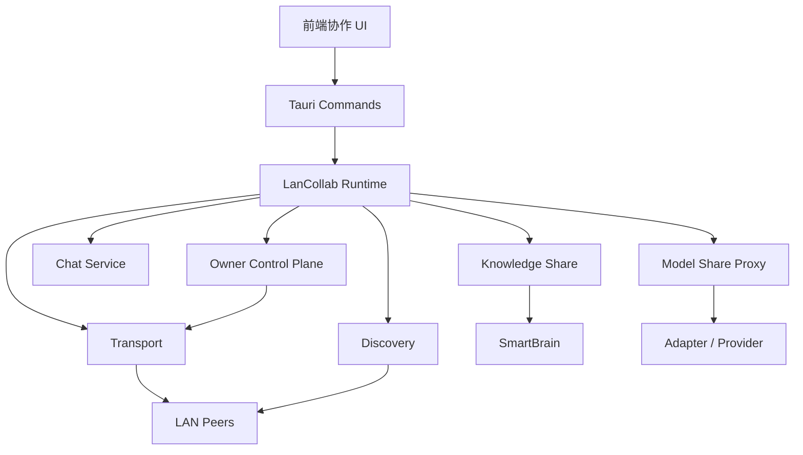
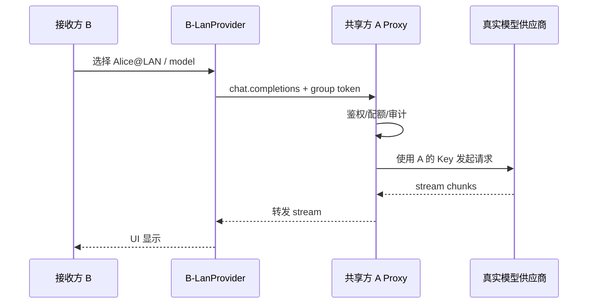
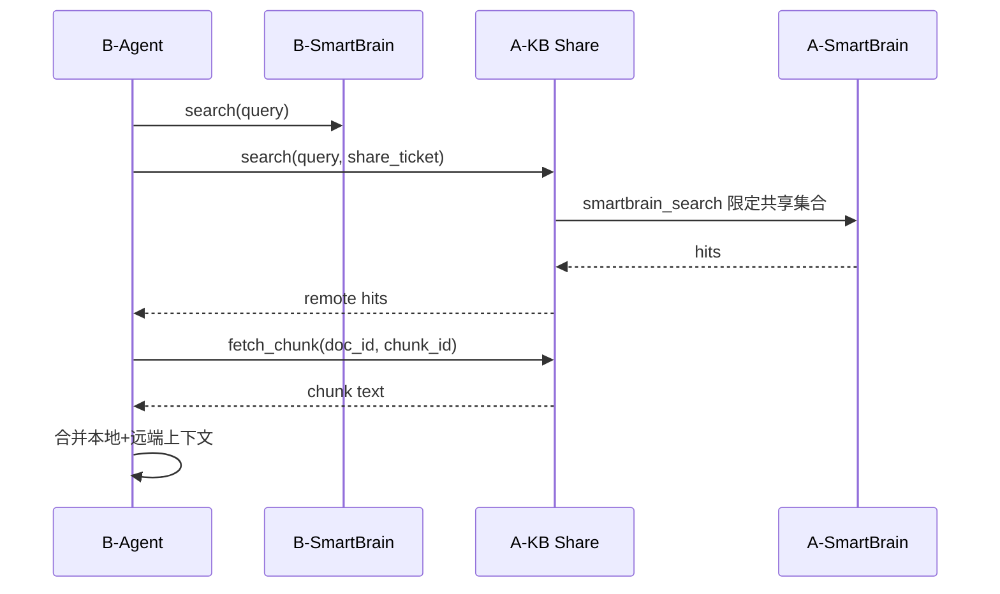

# CN-Codex 局域网无中心服务器协作设计报告

> 状态：设计草案（Design Draft）  
> 日期：2026-07-17  
> 范围：同局域网多 CN-Codex 客户端互发现、即时消息、知识库共享、模型共享  
> 约束：**不部署独立中心服务器**；所有能力由各客户端对等提供

---

## 1. 背景与目标

### 1.1 背景

当前 CN-Codex 是单机桌面应用（Tauri 2 + React + Rust）：

- 模型调用走本地配置的供应商（OpenAI 兼容 / Anthropic 等），Key 存在本机
- SmartBrain 知识库与经验存储在本机 `codey/memories` 等目录，通过 BM25 索引检索
- 已有 `mobile_server`（axum）用于本机手机端接入，但不是多 PC 对等协作
- 已有 `relay-server` 用于手机中继，属于**中心化**组件，**不作为本方案依赖**

团队场景常见诉求：

1. 多人在同一办公室 / 同一 Wi-Fi / 同一有线网段协作
2. 某位同事配置了可用模型，其他人不必各自申请 Key
3. 本地知识库可一键共享，同组成员可见并检索
4. 可像 IM 一样给局域网内其他 CN-Codex 发消息
5. **不希望运维任何额外服务器**

### 1.2 产品目标

| 能力 | 描述 | 成功标准 |
|------|------|----------|
| 节点发现 | 自动发现同局域网在线 CN-Codex | 30 秒内出现在“附近设备”列表 |
| 组网成组 | 用户可创建/加入协作组 | 同组可见共享资源；异组隔离 |
| 即时消息 | 1:1 与组内群聊文本消息 | 同网段延迟通常 < 200ms |
| 知识库共享 | 知识文档/目录可共享给组 | 接收方可列表、搜索、按需拉取 |
| 模型共享 | 共享方代理推理，接收方零 Key | 接收方可选共享模型直接对话 |
| 无中心服务器 | 无独立部署的中控服务 | 任意节点下线不影响其余直连会话 |

### 1.3 非目标（首期明确不做）

- 跨公网 / 跨 NAT 打洞（STUN/TURN/中继）
- 账号体系、云同步、组织级权限中心
- 完整 CRDT 多人实时协同编辑同一知识文档
- 共享方完全离线后的长期异步投递
- 把真实 API Key 分发给他人（**永久禁止**）
- 替换现有 `relay-server` 手机中继链路

---

## 2. 关键澄清：什么叫“不需要服务器”

### 2.1 语义

“无服务器”在本方案中指：

- **不需要**单独安装、运维、部署一台中心服务（如 Redis / 自建 Relay / 云端房间服）
- **需要**每个 CN-Codex 进程内嵌一个**本地 Peer 服务**（发现 + 会话 + 资源代理）

每个客户端同时是：

```text
Client（发起聊天/搜索/推理）
  +
Server（接受连接、提供消息、知识、模型代理）
```

这是 **P2P / 网状对等**，不是“零网络端口”。

### 2.2 与现有组件关系

| 现有组件 | 与本方案关系 |
|----------|--------------|
| `mobile_server` | 可复用 axum/tokio 技术栈；**不直接混用端口与协议** |
| `relay-server` | 公网/手机中继，**不进入** LAN P2P 路径 |
| SmartBrain | 作为知识共享数据源与检索后端 |
| `ConfigManager` / `model_providers` | 作为模型共享的上游真实供应商配置 |
| Adapter / AgentEngine | 共享模型请求最终仍走本机现有推理链路 |

---

## 3. 用户场景

### 场景 A：发现并加好友/入组

1. A 打开“局域网协作”，开启“可被发现”
2. B 在附近列表看到 `A-PC (Alice)`
3. B 申请加入 A 创建的组 `项目-Alpha`，或输入组邀请码
4. A 批准后，双方成为同组成员

### 场景 B：组内消息

1. A 在组聊发送“今晚发版检查清单”
2. 同组在线成员即时收到
3. 离线成员上线后，通过**在线成员互相补传**（gossip）尽量补齐最近消息

### 场景 C：知识库共享

1. A 在 SmartBrain 某知识目录点击“共享到组”
2. 选择组、权限（只读 / 可检索 / 可下载原文）
3. B 在“共享知识”面板看到该目录
4. B 的 Agent 检索时可命中远端共享知识（按需拉取 chunk）

### 场景 D：模型共享（零 Key）

1. A 开启“共享模型：DeepSeek-V3”，设置并发与日配额
2. B 在模型列表看到 `Alice@LAN / DeepSeek-V3`
3. B 选择该模型对话，无需配置任何 Key
4. 实际请求：`B -> A 本地代理 -> A 的真实供应商`
5. A 的 API Key **永不离开 A 机器**

---

## 4. 方案对比与推荐

### 方案 1：纯网状 P2P

```text
[Node A] <--QUIC/TCP--> [Node B]
   ^                         ^
   |                         |
   +-------- mDNS/UDP -------+
                |
             [Node C]
```

- **发现**：mDNS（主）+ UDP 组播/广播（兜底）
- **传输**：优先 QUIC（`quinn`），失败回退 TCP+TLS（自签证书）
- **消息/状态**：点对点 + 组内 gossip 补传
- **优点**：真正无中心；单点故障面小；符合“不需要服务器”
- **缺点**：组成员一致性、离线消息补齐更复杂；NAT 严格环境可能发现失败

### 方案 2：弱中心 Owner + P2P 混合（推荐）

```text
                    +----------------------+
                    | Group Owner (权威)    |
                    | 组元数据 / 成员 / ACL |
                    +----------+-----------+
                               ^
                     控制面同步 | (join/approve/policy)
                               |
        [Node A] <----P2P----> [Node B] <----P2P----> [Node C]
           |                      |                      |
           +------ 聊天 / 模型代理 / 知识拉取（业务面） ----+
```

**控制面（弱中心，Owner 唯一权威）**

- 组元数据：`group_id`、名称、邀请码、成员列表、角色、策略
- 权限变更：批准加入、踢人、改角色、撤销共享授权
- 成员关系快照由 Owner 签名后下发；成员本地缓存只读副本

**业务面（P2P 直连）**

- 聊天消息：成员间直连 + 可选在线补传
- 模型代理：接收方直连共享方节点
- 知识拉取：接收方直连共享方节点按需取 chunk

**Owner 离线时的降级**

- 已建立的业务会话可继续（聊天/模型/知识拉取只要双方在线）
- 不能做成员变更、邀请批准、策略修改
- Owner 重新上线后以 Owner 快照为准做收敛（版本号 + 签名）

- **优点**：无独立中心服务器；组成员/权限语义清晰；实现复杂度显著低于纯 gossip 强一致
- **缺点**：Owner 离线时控制面冻结；需明确 UI 降级提示

### 方案 3：局域网选举协调者（Coordinator Election）

- 组内动态选举一个 Coordinator 负责房间状态与消息 fan-out
- 协调者下线后重新选举
- **优点**：实现简单，接近中心房间模型
- **缺点**：切主抖动；语义更像迷你服务器；首期不采用

### 方案 4：用户指定 Host（伪无服务器）

- 某台机器手动开启“主机模式”，其他人填 IP 加入
- **优点**：实现最快
- **缺点**：有主机依赖；体验像搭服务器；不推荐作为主路径

### 推荐结论

**采用方案 2（弱中心 Owner + P2P 混合）作为主架构**：

- **控制面**：Group Owner 为组元数据、成员关系、权限策略的唯一权威
- **业务面**：聊天、模型代理、知识拉取保持节点间 P2P 直连
- **发现**：mDNS + UDP 兜底 + 手动 IP/端口/邀请码
- **不采用**独立中心服务器、长期固定 Host、首期动态选举 Coordinator

---

## 5. 总体架构

### 5.1 模块划分（建议新增 `lan_collab`）

```text
src-tauri/src/lan_collab/
├── mod.rs                 # 模块入口 / 生命周期
├── identity.rs            # 节点身份、密钥、设备证书
├── discovery.rs           # mDNS + UDP 发现
├── transport.rs           # QUIC/TLS 连接管理
├── protocol.rs            # 帧协议 / 消息类型
├── group.rs               # 组、成员、邀请码（Owner 权威快照）
├── chat.rs                # 1:1 / 群聊 / 历史补传
├── knowledge_share.rs     # 知识共享清单与拉取
├── model_share.rs         # 模型代理（OpenAI 兼容）
├── store.rs               # 本地协作状态持久化
└── commands.rs            # Tauri 命令
```

前端建议新增：

```text
src/components/lan/
└── LanCollabPanel.tsx     # 右侧面板“局域网协作”Tab 内容

# 入口：右侧栏新增独立 icon（与 browser/project/terminal/git 并列）
# RightPanelTab 扩展： "lan"
```

### 5.2 逻辑分层



### 5.3 进程内运行时

每个客户端启动后（用户开启“局域网协作”时）：

1. 加载/生成节点身份 `NodeId` + 设备密钥对
2. 启动本地 Peer 端口（默认动态或固定区间，如 `47800-47820`）
3. 启动 mDNS 广播服务名：`_cn-codex-collab._udp.local`
4. 启动 UDP 发现兜底
5. 接受入站 QUIC/TLS 连接
6. 向前端推送 peer 上下线、消息、共享变更事件

关闭协作或退出应用时：

1. 广播 `bye`
2. 停止发现
3. 优雅关闭连接
4. 持久化未确认消息与组状态

---

## 6. 身份、组与安全模型

### 6.1 节点身份

每个安装实例生成并持久化：

```json
{
  "node_id": "node_01HZX...",
  "display_name": "Alice-PC",
  "device_pubkey": "ed25519...",
  "device_cert": "self-signed x509 or raw pubkey cert",
  "created_at": 1710000000
}
```

- `NodeId`：稳定 ID（ULID/UUID v7）
- 连接层使用设备密钥做双向身份校验
- 显示名可改，ID 不可变

### 6.2 协作组（Group）

```json
{
  "group_id": "grp_01HZY...",
  "name": "项目-Alpha",
  "created_by": "node_01HZX...",
  "created_at": 1710000000,
  "members": [
    {"node_id": "node_A", "role": "owner", "joined_at": 1710000000},
    {"node_id": "node_B", "role": "member", "joined_at": 1710000100}
  ],
  "invite": {
    "code": "ALPHA-7K2Q",
    "expires_at": 1710086400,
    "max_uses": 20
  },
  "policy": {
    "chat": true,
    "knowledge_share": true,
    "model_share": true,
    "require_owner_approve": true
  }
}
```

**Owner 权威规则：**

- 每个组有且仅有一个 `owner`（`created_by`）
- 成员列表、角色、邀请策略仅 Owner 可修改
- Owner 发布带 `snapshot_version` 的组快照；成员缓存副本，冲突时以更高版本 + Owner 签名为准
- Owner 离线：业务面可继续；控制面（加人/踢人/改策略）冻结

**成组方式：**

1. 创建组 → 生成邀请码 / 二维码（含 `group_id + invite_token`）
2. 附近设备点“申请加入” → owner/管理员批准
3. 输入邀请码直接加入（可配置是否需批准）

**权限角色（首期）：**

| 角色 | 权限 |
|------|------|
| owner | 管理成员、撤销共享、解散组 |
| admin | 批准加入、管理共享策略 |
| member | 发消息、使用已授权共享 |

### 6.3 信任与加密

**强制要求：**

1. 传输层加密：QUIC/TLS 或 TCP+TLS，禁止明文业务载荷
2. 设备身份：首次连接展示指纹，用户确认后 TOFU（Trust On First Use）固定
3. 组密钥：组创建时生成 `GroupKey`，用于群消息可选端到端加密
4. 邀请码具备过期与次数限制
5. 所有共享默认**显式开启**，默认拒绝入站共享请求

**绝不做：**

- 传输或存储他人的真实模型 API Key
- 未经确认自动信任新设备
- 将共享权限默认放开到“全局域网任何人”

### 6.4 威胁模型（首期）

| 威胁 | 缓解 |
|------|------|
| 同网嗅探 | TLS/QUIC 加密 |
| 伪装节点 | 设备指纹 TOFU + 签名 |
| 未授权使用模型 | 组授权 + 会话令牌 + 配额 |
| 知识越权 | 共享 ACL + 按资源签发拉取票据 |
| 资源耗尽 | 并发限制、速率限制、体积限制 |
| 恶意大文件 | 分片、校验和、最大文档限制 |

---

## 7. 发现与连接协议

### 7.1 服务发现

**主路径：mDNS**

- 服务类型：`_cn-codex-collab._udp.local`
- TXT 记录（示意）：

```text
id=node_01HZX
name=Alice-PC
ver=1
port=47811
caps=chat,kb,model
fp=ab12cd34
```

**兜底：UDP 广播/组播**

- 固定组播地址（例如 `239.255.77.77:47888`）或子网广播
- 报文：`HELLO` / `HELLO_ACK` / `BYE`
- 周期：默认 5s announce，30s 超时离线

**手动加入兜底：**

- 用户输入 `ip:port` 或粘贴“连接串”
- 适用于禁用组播的公司网

### 7.2 传输与会话

1. 发现 peer 后，发起 QUIC 连接（优先）
2. 完成证书/公钥校验（TOFU）
3. 应用层 `Hello` 交换：`node_id/version/caps/groups`
4. 建立多路复用通道：
   - `ctrl`：控制、心跳、组成员同步
   - `chat`：消息
   - `kb`：知识清单/拉取
   - `model`：推理代理（可独立 HTTP 兼容入口）

心跳：15s ping / 45s 超时断开。

### 7.3 应用层消息信封

```json
{
  "v": 1,
  "id": "msg_01HZ...",
  "ts": 1710000123,
  "from": "node_A",
  "to": "node_B | group:grp_X | *",
  "type": "chat.text | kb.announce | kb.fetch | model.offer | ...",
  "sig": "ed25519-signature",
  "payload": {}
}
```

所有业务消息可验证签名，防篡改与伪造。

---

## 8. 即时消息设计

### 8.1 能力范围（首期）

- 1:1 私聊
- 组内群聊
- 文本 + 简单附件元数据（附件本体可走分片传输，二期增强）
- 已读/送达状态（best effort）
- 最近 N 天历史本地存储

### 8.2 投递模型

**在线直送：**

```text
A --chat.text--> B
B --chat.ack--> A
```

**群聊：**

- 发送者向当前在线成员 fan-out
- 同时写入本地 outbox
- 成员上线后通过 `chat.sync` 按 `seq` 补齐

**序号：**

- 每组维护单调 `seq`（发送者本地分配 + 因果元数据）
- 首期不做强一致全序，采用“足够好的因果序 + 时间戳展示”

### 8.3 本地存储

建议 SQLite 表：

- `lan_peers`
- `lan_groups`
- `lan_group_members`
- `lan_messages`
- `lan_outbox`
- `lan_shares_kb`
- `lan_shares_model`
- `lan_trust_store`

路径建议：`codey/lan_collab/collab.db`

---

## 9. 知识库共享设计

### 9.1 设计原则

1. **默认不共享**任何本地知识
2. 共享的是“授权视图”，不是裸盘全量拷贝（除非用户选择导出）
3. 远端检索优先走**元数据索引 + 按需 chunk 拉取**
4. 共享方可随时撤销；撤销后接收方失去在线访问权

### 9.2 共享对象

| 层级 | 示例 | 首期 |
|------|------|------|
| 单文档 | 某 OKF/Markdown 知识 | 支持 |
| 目录/来源组 | `source_group=项目规范` | 支持 |
| 全库 | 全部 knowledge | 不建议默认开放 |
| 经验库 experiences | 自动提取经验 | 二期（隐私风险更高） |

### 9.3 共享清单（Manifest）

共享方发布：

```json
{
  "share_id": "kshare_01...",
  "group_id": "grp_X",
  "owner_node": "node_A",
  "title": "项目规范库",
  "mode": "online_search",  
  "permission": "search_and_read",
  "docs": [
    {
      "doc_id": "doc_123",
      "title": "发布流程",
      "domain": "devops",
      "tags": ["release"],
      "updated_at": 1710000000,
      "content_hash": "sha256:..."
    }
  ],
  "revision": 12
}
```

`mode`：

- `online_search`：在线检索 + 按需拉取（推荐默认）
- `snapshot_export`：打包快照给接收方本地导入（适合离线携带）

### 9.4 检索链路

**在线模式（推荐）：**

```text
B Agent 需要知识
  -> B 本地 + 远端共享并行检索
  -> 对远端命中项向 A 请求 chunk
  -> A 校验 B 的组身份与 share ACL
  -> 返回脱敏后的 chunk 文本
  -> B 注入上下文（标注来源：Alice/项目规范库）
```

注意：

- 不在接收方永久复制全文，除非用户点击“保存到我的知识库”
- 注入上下文必须标注来源节点，避免与本地知识混淆

### 9.5 与 SmartBrain 集成点

复用现有能力：

- `smartbrain_list_knowledge`
- `smartbrain_read_knowledge`
- `smartbrain_search` / BM25 索引

新增：

- `lan_share_knowledge(share_req)`
- `lan_unshare_knowledge(share_id)`
- `lan_list_remote_knowledge()`
- `lan_search_remote_knowledge(query, group_id?)`
- Agent 工具扩展：`smartbrain_search` 可配置是否包含远端共享源

### 9.6 权限与撤销

- ACL 绑定 `group_id + share_id + permission`
- 拉取请求必须带短期 `share_ticket`（由共享方签发，5-15 分钟）
- 撤销后：
  - 停止签发新 ticket
  - 广播 `kb.revoke`
  - 接收方 UI 标记失效
  - 已本地保存的副本是否删除由接收方策略决定（默认保留但标记“原共享已撤销”）

---

## 10. 模型共享设计（核心）

### 10.1 原则

1. **共享的是推理能力，不是 Key**
2. 接收方零配置 Key 即可用
3. 共享方完整控制：开关、模型白名单、并发、配额、审计
4. 对外暴露 OpenAI 兼容接口，便于接入现有 `model_providers` 体系

### 10.2 用户可见形态

共享方设置：

- 选择可共享的本地已启用模型（如 `deepseek-chat`）
- 显示名：`Alice-共享 / DeepSeek`
- 限制：最大并发、每分钟请求数、每日 token、允许的组
- 可选：仅组内、或需每次审批

接收方：

- 在供应商列表出现虚拟供应商：`lan-share:<node_id>`
- 模型列表出现远端模型
- 选择后像普通模型一样聊天
- 无需填写 API Key（使用组会话令牌）

### 10.3 请求路径

```text
[接收方 B UI/Agent]
   |  OpenAI-compatible request
   v
[B 本地 provider: lan-share]
   |  QUIC/TLS 或 LAN HTTP(S)
   v
[共享方 A: Model Share Proxy]
   |  鉴权 + 配额 + 审计
   v
[A 现有 Adapter -> 真实供应商 API]
   |  SSE/stream
   v
[回传 B]
```

### 10.4 代理 API（共享方本地）

建议在 Peer 服务中提供兼容子集：

- `GET /v1/models`
- `POST /v1/chat/completions`（支持 stream）
- 可选：`POST /v1/responses`（若后续统一）

鉴权头：

```http
Authorization: Bearer lan_<group_session_token>
X-CN-Codex-Node: node_B
X-CN-Codex-Share: mshare_01...
```

`group_session_token`：

- 入组后由 owner/共享方轮转签发
- 短时有效，可刷新
- 绑定 `group_id + node_id + scope=model_use`

### 10.5 共享方策略引擎

每次请求检查：

1. 协作总开关是否开启
2. 该模型是否在共享白名单
3. 请求方是否同组且 token 有效
4. 并发是否超限
5. RPM / TPM / 日额度是否超限
6. 是否允许 stream、工具调用、长上下文

拒绝时返回明确错误：

```json
{
  "error": {
    "message": "share quota exceeded",
    "type": "lan_share_quota",
    "code": "quota_daily_tokens"
  }
}
```

### 10.6 成本与风险控制

| 风险 | 控制 |
|------|------|
| 他人刷爆 Key 额度 | 默认低配额；可一键停用共享 |
| 敏感 prompt 经过共享方 | UI 明确提示“请求内容对共享方可见” |
| 共享方离线 | 接收方自动标记模型不可用并回退本地模型 |
| 共享方版本不兼容 | Hello 中协商 `model_proxy_ver` |
| 日志泄露 | 默认只记元数据（token 数/时间/调用方），不落全文 prompt |

**关键产品文案：**

> 使用他人共享模型时，你的提示词会发送到对方电脑进行代理请求，请勿发送高度敏感信息。

### 10.7 与现有配置系统集成

在 `ConfigManager` 动态注入只读 provider：

```toml
[model_providers.lan-share-nodeA]
name = "Alice@LAN"
base_url = "https://127.0.0.1:<local-forward-port>/v1"
wire_api = "chat"
requires_openai_auth = false
# token 由 lan_collab 运行时注入内存，不写明文到用户可编辑配置
```

实现建议：

- 不把临时 token 持久化进 `codey/config.toml`
- 由 `lan_collab` 维护内存态 provider，前端设置页只读展示
- 断开/撤销后自动移除

---

## 11. 前端交互草案

### 11.1 入口

设置 / 侧栏新增：**局域网协作**

页面分区：

1. 总开关 + 本机显示名 + 端口状态
2. 附近设备
3. 我的组
4. 消息
5. 共享知识
6. 共享模型
7. 信任设备与安全

### 11.2 关键路径（最短）

1. 打开总开关
2. 创建组或输入邀请码
3. 共享一个模型 / 一个知识目录
4. 对方加入后即可聊天与使用

### 11.3 SmartBrain 集成 UI

知识条目/目录操作菜单增加：

- 共享到组…
- 取消共享
- 查看谁可访问

共享对话框字段：

- 目标组
- 权限：仅列表 / 可搜索 / 可阅读原文 / 允许转存
- 有效期（可选）

### 11.4 模型选择器集成

现有“供应商 + 模型”双下拉中：

- 供应商分组增加 `局域网共享`
- 模型项显示在线状态灯
- 离线时置灰并提示“共享方不在线”

---

## 12. 协议能力清单（首期 MVP）

### 12.1 必须实现

- [x] 设计：节点身份 / TOFU
- [ ] mDNS + 手动 IP 发现
- [ ] QUIC 或 TCP+TLS 会话
- [ ] 创建组 / 邀请码加入 / 成员列表
- [ ] 组内文本消息
- [ ] 知识共享清单 + 按需读取
- [ ] 模型共享代理（chat completions + stream）
- [ ] 配额与撤销
- [ ] 前端基础面板

### 12.2 明确延后

- 文件大附件 P2P 传输加速
- 经验库自动共享
- 端到端群密钥定期轮转 UI
- 跨子网 / VPN 复杂拓扑优化
- 消息已读回执强一致
- 多管理员复杂 RBAC

---

## 13. 推荐技术选型（Rust）

| 领域 | 推荐 | 备注 |
|------|------|------|
| 异步运行时 | 现有 tokio | 与 Tauri 一致 |
| HTTP 框架 | axum | 已用于 `mobile_server` |
| QUIC | quinn | 现代多路复用；若首期风险高可先 TCP+TLS |
| TLS | rustls + 自签证书 | TOFU 固定指纹 |
| mDNS | mdns-sd / configno 类库 | Windows 需验证防火墙体验 |
| 序列化 | serde_json / messagepack | 控制面 JSON，大数据可 msgpack |
| 签名 | ed25519-dalek | 节点与消息签名 |
| 本地库 | SQLite（rusqlite/sqlx） | 消息与共享状态 |
| 前端状态 | Zustand | 与现有 stores 一致 |

### 首期落地策略（降低风险）

若 QUIC + mDNS 在 Windows 防火墙场景摩擦大，采用两阶段：

1. **MVP-A**：TCP+TLS + 手动 IP/二维码加入 + 模型共享 + 基础聊天
2. **MVP-B**：补 mDNS 自动发现 + 知识共享在线检索 + gossip 补消息
3. **MVP-C**：QUIC 升级、附件、更细 ACL、审计面板

这仍满足“无中心服务器”，只是发现体验逐步增强。

---

## 14. 数据流总览

### 14.1 模型共享时序



### 14.2 知识共享检索时序



---

## 15. 配置项建议

```toml
[lan_collab]
enabled = false
display_name = ""
bind_port = 0                 # 0 = 自动
enable_mdns = true
enable_udp_fallback = true
data_dir = "lan_collab"
max_message_days = 30

[lan_collab.discovery]
announce_interval_secs = 5
peer_timeout_secs = 30

[lan_collab.model_share]
enabled = false
default_daily_token_limit = 200000
default_rpm = 20
max_concurrency = 2
log_prompt_bodies = false

[lan_collab.knowledge_share]
enabled = false
default_permission = "search_and_read"
max_chunk_bytes = 65536
allow_export_snapshot = true
```

---

## 16. Tauri 命令草案

| 命令 | 作用 |
|------|------|
| `lan_collab_status` | 开关、端口、本机身份 |
| `lan_collab_set_enabled` | 启用/停用 |
| `lan_collab_list_peers` | 附近节点 |
| `lan_collab_trust_peer` | TOFU 确认 |
| `lan_collab_create_group` | 建组 |
| `lan_collab_join_group` | 邀请码加入 |
| `lan_collab_list_groups` | 组列表 |
| `lan_collab_send_message` | 发消息 |
| `lan_collab_list_messages` | 拉历史 |
| `lan_collab_share_knowledge` | 共享知识 |
| `lan_collab_unshare_knowledge` | 取消共享 |
| `lan_collab_search_shared_knowledge` | 搜远端知识 |
| `lan_collab_share_model` | 发布模型共享 |
| `lan_collab_unshare_model` | 停止模型共享 |
| `lan_collab_list_shared_models` | 可用共享模型 |
| `lan_collab_model_share_stats` | 配额与调用统计 |

事件（前端 listen）：

- `lan://peer-updated`
- `lan://message`
- `lan://group-updated`
- `lan://knowledge-share-updated`
- `lan://model-share-updated`
- `lan://error`

---

## 17. 与“完全无服务器”相关的边界说明

1. **每个客户端都有本地监听端口**  
   这不是中心服务器，而是 P2P 节点服务。

2. **消息不是全局强一致邮箱**  
   无中心存储时，离线消息只能“尽力补传”。长时间全员离线可能丢补齐机会，需在 UI 说明。

3. **模型共享依赖共享方在线**  
   共享方关机后，其模型立即不可用；这是无中心架构的自然结果。

4. **企业网限制**  
   若禁用 mDNS/广播，必须提供手动连接串；这仍无中心服务器。

5. **安全默认关闭**  
   局域网不等于可信；默认不广播敏感能力，所有共享均显式授权。

---

## 18. 分阶段实施计划

### Phase 0：设计冻结（本文档）

- 确认目标、非目标、安全红线
- 确认 MVP 只做：发现/组/消息/知识共享/模型共享

### Phase 1：骨架与发现

- 节点身份、本地 DB、Peer 服务生命周期
- 手动连接 + mDNS
- 附近设备 UI
- 右侧面板“局域网协作”独立入口 icon

### Phase 2：组与聊天

- 建组、邀请码、成员管理（Owner 控制面）
- 组文本消息、本地历史

### Phase 3：模型共享 MVP

- OpenAI 兼容代理
- 动态注入 lan provider
- 配额/撤销/在线状态
- 这是最高业务价值路径，建议优先于复杂知识同步

### Phase 4：知识共享 MVP

- 共享清单
- 远端搜索 + chunk 拉取
- SmartBrain UI“共享到组”
- Agent 检索合并

### Phase 5：加固

- 审计面板、速率限制、指纹管理
- 连接稳定性、Windows 防火墙引导
- 测试矩阵与文档

---

## 19. 测试策略

### 19.1 单元测试

- 邀请码校验、ACL、配额计算
- 消息序与 outbox 重试
- 知识 manifest 差分
- provider token 不落盘

### 19.2 集成测试

- 本机双实例（不同 data dir + 端口）互连
- 共享模型 stream 往返
- 撤销共享后请求失败
- 节点离线后 UI 状态收敛

### 19.3 手工场景

- 两台真实电脑同一 Wi-Fi
- 禁用 mDNS 时手动 IP 加入
- 防火墙首次弹窗
- 共享方断网，接收方回退

---

## 20. 风险与开放问题

### 20.1 已识别风险

| 风险 | 等级 | 应对 |
|------|------|------|
| Windows 防火墙/组播受限 | 高 | 手动连接兜底 + 清晰引导 |
| 模型共享导致费用失控 | 高 | 默认低配额 + 一键停用 + 审计 |
| 提示词对共享方可见 | 高 | 强制风险提示，不做虚假“端到端推理”承诺 |
| 知识误共享泄密 | 高 | 默认关闭、目录级授权、撤销 |
| P2P 消息补齐复杂 | 中 | 首期只保证在线消息，离线补齐 best effort |
| 与 mobile_server 端口冲突 | 低 | 独立端口段与模块 |

### 20.2 待产品确认的问题

1. 组规模预期：2-5 人小团队，还是 20+ 人局域网？
2. 模型共享是否允许非同组的“临时授权码”？
3. 知识共享默认在线拉取，还是更倾向一键快照导入？
4. 是否需要“仅聊天、不共享模型/知识”的轻量模式作为默认？
5. 显示名是否允许重名（ID 不同）？

> 上述问题不阻塞设计草案，但会影响 Phase 1 接口细节。

---

## 21. 结论

要实现“多个 CN-Codex 在局域网互相聊天、共享知识库、共享模型，且不需要任何中心服务器”，推荐架构是：

**每个客户端内嵌 Peer 运行时的「弱中心 Owner + P2P 业务面」混合架构**

- 发现：mDNS + UDP 兜底 + 手动连接
- 传输：加密直连（QUIC/TLS）
- 协作边界：显式 Group + ACL（Owner 权威）
- 知识共享：清单 + 在线按需拉取（可导出快照）
- 模型共享：共享方本地反向代理真实供应商，**Key 永不外传**
- 产品原则：默认关闭、显式授权、可撤销、可限流

该方案与现有 CN-Codex 架构契合点高：

- 传输/服务可复用 axum + tokio 经验（`mobile_server`）
- 知识复用 SmartBrain
- 模型复用 Adapter / model_providers，仅新增“局域网虚拟供应商”

建议实施顺序：**模型共享 MVP → 组聊天 → 知识共享**，以最快验证“别人免 Key 用我的模型”这一核心价值。

---

## 22. 附录：术语表

| 术语 | 含义 |
|------|------|
| Node | 一台运行中的 CN-Codex 客户端实例 |
| Peer | 已发现并可连接的 Node |
| Group | 协作组，共享与消息的授权边界 |
| Owner | 组创建者；控制面权威节点 |
| Control Plane | 组元数据/成员/权限同步通道 |
| Data Plane | 聊天、模型代理、知识拉取等业务直连 |
| TOFU | 首次信任并固定设备指纹 |
| Model Share Proxy | 共享方提供的本地模型代理服务 |
| Knowledge Manifest | 共享知识的元数据清单 |
| share_ticket | 短期资源访问票据 |
| 无中心服务器 | 无独立部署中控；节点对等直连 |

---

## 23. 附录：最小可行协议消息类型

```text
ctrl.hello
ctrl.hello_ok
ctrl.ping / ctrl.pong
ctrl.bye

group.invite_info
group.join_request
group.join_accept
group.join_reject
group.member_update

chat.text
chat.ack
chat.sync_request
chat.sync_response

kb.announce
kb.revoke
kb.search_request
kb.search_response
kb.fetch_request
kb.fetch_response

model.offer
model.revoke
model.session_token
# 实际推理走兼容 HTTP/stream，不全部塞进自定义帧
```

---

**文档结束。** 若该设计方向确认，下一步应输出可执行的实现计划（`docs/superpowers/plans/...`），并按 Phase 拆分为可交付里程碑。
